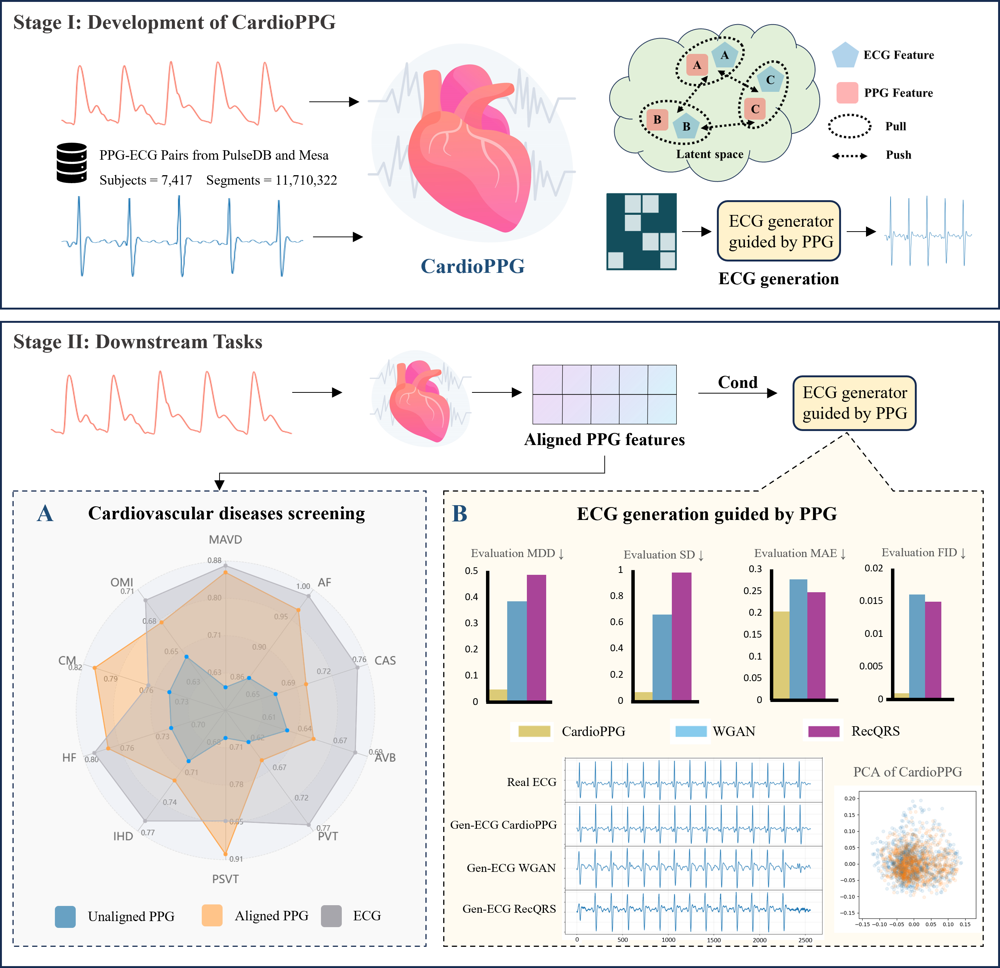

# CardioPPG

AI Modelling Photoplethysmography to Electrocardiography Useful for Predicting Cardiovascular Disease - A Pilot Study.



## Abstract

Cardiovascular diseases (CVDs) remain the leading cause of global mortality, with early detection critical for improving patient outcomes. Traditional electrocardiography (ECG) is limited by issues of sensitivity, convenience, and the inability to monitor patients continuously at home, underscoring the need for alternative solutions. We present CardioPPG, a cross-modal learning framework that leverages photoplethysmography (PPG) to generate ECG signals and predict CVDs. Through cross-modal contrastive learning, CardioPPG aligns PPG and ECG features in a shared latent space, followed by an autoregressive generative model that synthesizes high-quality ECG signals. Extensive evaluations demonstrate that CardioPPG significantly outperforms baseline models in detecting mitral and aortic valve diseases, atrial fibrillation, cardiomyopathy, and paroxysmal supraventricular tachycardia, with AUC improvements of 41.3%, 12.2%, 8.8%, and 30.3%, respectively. Furthermore, it generates ECG signals whose distributions closely match those of authentic ECGs, enhancing result interpretability. CardioPPG offers a scalable, real-time, non-invasive solution for CVD monitoring, with significant potential for use in home settings and resource-limited environments, thus facilitating early detection and timely intervention.

## Environment Set Up

Install required packages:

```bash
conda env create -f requirements.yml
```


Activate the newly created environment:

```
conda activate ppgecg
```

## Example datasets and pretrained weights

Our model consists of two main components: 

### A. autoregression-based ECG generative model

The model weights can be accessed from the following Google Drive folder:
[OneDrive Link](https://1drv.ms/f/c/8cfe2ce6d8663506/EnI7mm7jMEdGnwNpy8yBL_QB0lvOhwdRvBoRwv5MsQUD0w?e=ccbave). 
[Baidu Drive Link](https://pan.baidu.com/s/1HAW1e-UUeSQtfxX04P6gGQ?pwd=kh4e).
The folder contains two folder: downtask and generator, open generator:

* **stage1-custom-2025-3-11-14-55-8.ckpt** (ECG generator stage1 checkpoint)
* **stage2-custom-2025-3-16-23-26-27.ckpt** (ECG generator stage2 checkpoint)
* **aligned_ppg.pth** (PPG condition encoder checkpoint)
* **example_ppg.npy** (example ppg npy file)

To set up the model:
```
cd Signal_generate/TimeVQVAE
```

* Download **stage1-custom-2025-3-11-14-55-8.ckpt, stage2-custom-2025-3-16-23-26-27.ckpt, aligned_ppg.pth** and place it in the **Signal_generate/TimeVQVAE/saved_models/** directory.
* Download **example_ppg.npy** and place it in the **Signal_generate/TimeVQVAE/data/** directory.


To quickly use the PPG-guided ECG generation model, we have provided a simple startup script. Run the following command to execute the script:

```
python simple_gen.py --use_custom_dataset True --dataset_names custom  --gpu_device_idx 0 --config configs/config_ppgecg_stage1_2.yaml
```
If you need more data, please contact the corresponding author of this article.


### B. Aligned ECG model


The second part of our model involves fine-tuning the aligned PPG encoder for downstream tasks. We perform full fine-tuning for each downstream task, and here we provide an example using MIMIC_AF data and weights for atrial fibrillation prediction.

The data and model weights can be accessed at
[OneDrive Link](https://1drv.ms/f/c/8cfe2ce6d8663506/EnI7mm7jMEdGnwNpy8yBL_QB0lvOhwdRvBoRwv5MsQUD0w?e=ccbave). 
[Baidu Drive Link](https://pan.baidu.com/s/1HAW1e-UUeSQtfxX04P6gGQ?pwd=kh4e).
The folder contains two folder: downtask and generator, open downtask:

* **AF/checkpoint-4-AUC-0.966.pth** (PPG model for binary classification of atrial fibrillation)
* **AF/test.pkl** (Processed MIMIC_AF data)

Setup Instructions:

```
cd Signal_downtask/simple_test
```
* Download **AF/checkpoint-4-AUC-0.966.pth** and place it in the **simple_test/checkpoint/** directory.
* Download **example_ppg.npy** and place it in the **simple_test/data/** directory.

Run the following command to execute the script:
```
python test.py
```
If you need more data and weights, please contact the corresponding author of this article.


## Data available

The datasets used in this study are publicly available or accessible upon request. The MIMIC and VITAL datasets were obtained from PulseDB and can be accessed via their GitHub repository at https://github.com/pulselabteam/PulseDB. The Mesa dataset is available through the National Sleep Research Resource and can be accessed upon registration at https://sleepdata.org/datasets/mesa. All datasets were used in accordance with their respective access policies and licensing agreements.

## Citation

If you find our paper/code useful, please consider citing our work:
